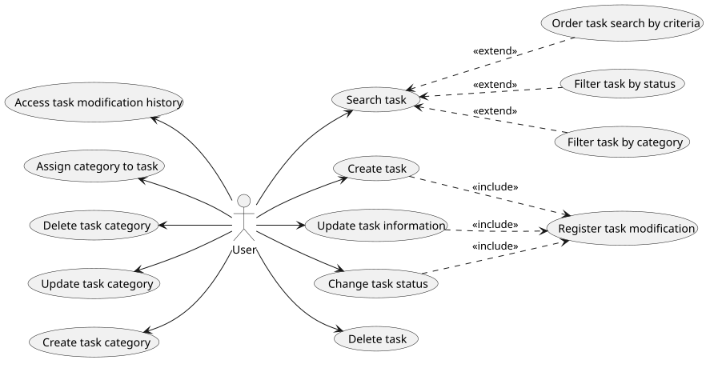
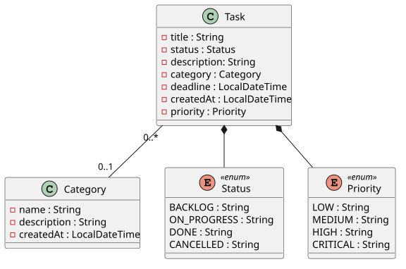
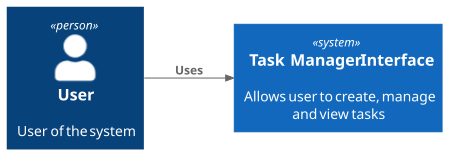
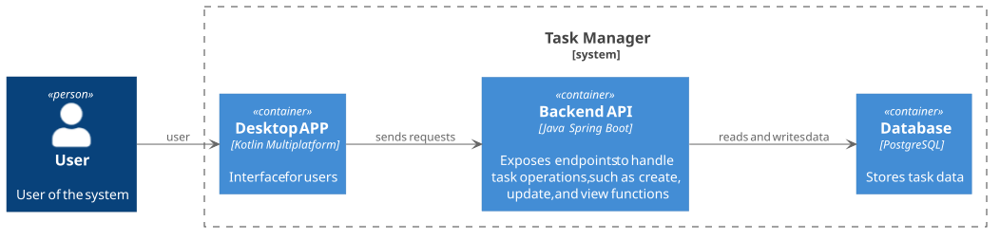

# task-manager-api
Projeto pessoal de gerenciamento de tarefas

O objetivo do projeto é desenvolver funcionalidades utilizando como base os princípios e boas práticas de programação em Java descritas no livro Java Efetivo

Além da implementação das funcionalidades do sistema, o projeto será utilizado como ambiente de estudo para explorar conceitos de engenharia de software, 
arquitetura, persistência de dados, modelagem de domínio, testes e ferramentas utilizadas no desenvolvimento de aplicações modernas.

---
# Documentação

## Requisitos
- [Requisitos Funcionais](docs/requirements/functional-requirements.md)
- [Requisitos Não Funcionais](docs/requirements/non-functional-requirements.md)
---
## Diagramas

O projeto utiliza a ferramenta de modelagem **PlantUML** para manutenção dos diagramas, incluindo:
- Diagrama de casos de uso
- Diagrama de entidade-relacionamento (ER)
- Diagrama de classes

A escolha do PlantUML foi feita considerando os pontos:
- Documentação como código, permitindo versionamento junto ao código fonte
- Facilidade de manutenção
- Para fins de estudo da ferramenta

### Diagrama de casos de uso:

### Diagrama Entidade Relacionamento

### Diagrama de Classes:

---
## Arquitetura
A arquitetura do sistema é definida seguindo o C4 Model, utilizando essencialmente as primeiras duas camadas:

### Diagrama de contexto do sistema:

### Diagrama de container:

